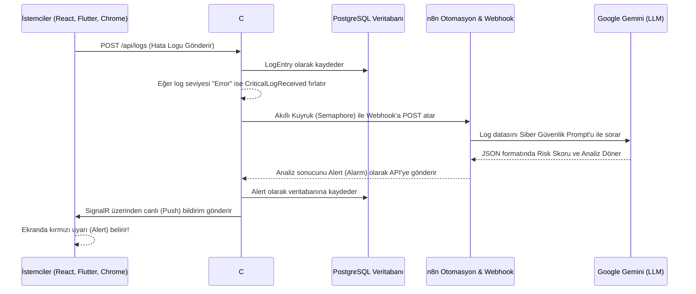

# Sentinel - Yapay Zeka Destekli Dağıtık Log İzleme ve Güvenlik Uyarı Sistemi

Sentinel, modern yazılım mimarilerinde dağıtık sistemlerden (mikroservisler, istemciler, mobil cihazlar) gelen logları merkezi olarak toplayan, veritabanına işleyen ve kritik hataları anında **Yapay Zeka (Google Gemini LLM)** ile siber güvenlik perspektifinden analiz ederek kullanıcılara **gerçek zamanlı (SignalR)** bildiren uçtan uca bir sistemdir.

---

## 🏗️ Sistem Mimarisi (Mermaid Şeması)

Aşağıdaki şema, logun üretilmesinden yapay zeka analizine ve ekranda uyarı olarak görünmesine kadar olan veri akışını özetler:



---

## 🧠 Detaylı Süreç ve Bileşen Analizi

### 1. Veritabanı Süreci (PostgreSQL & Entity Framework Core)
Projenin kalıcı verileri, Docker üzerinde koşan PostgreSQL veritabanında tutulmaktadır. C# .NET tarafında Entity Framework Core (Code-First) yaklaşımı kullanılmıştır.
- **Agents Tablosu:** Sisteme bağlanan her yeni istemci (Chrome Eklentisi, React sayfası vb.) kendini bir "Agent" olarak kaydettirir. Böylece hangi hatanın hangi cihazdan/tarayıcıdan geldiği takip edilir.
- **LogEntries Tablosu:** Sisteme akan tüm loglar `SourceService`, `Message`, `Level` (Information, Warning, Error, Critical) ve `CreatedAt` gibi verilerle ilişkisel olarak tutulur.
- **Alerts Tablosu:** Yapay zekanın analiz ettiği hatalar, döndürdüğü `Risk Skoru`, `Tehdit Kategorisi (Örn: BruteForce, XSS)` ve `Detaylı Açıklama` ile birlikte bu tabloda saklanır. Alertlerin `IsAcknowledged` (okundu/onaylandı) durumu da tutulur.

### 2. Log Toplama ve İç Süreçler (C# API & MediatR)
- **Log Ingestion Endpoint'i:** C# API'sindeki `/api/logs` endpoint'i, saniyede yüzlerce logu karşılayacak şekilde asenkron tasarlanmıştır.
- **Olay Güdümlü Mimari (Event-Driven):** Bir log veritabanına eklendikten sonra, logun `Level` değeri kontrol edilir. Eğer log bir hata (Error/Critical) ise, sistem içi iletişim kütüphanesi olan **MediatR** üzerinden bir `CriticalLogReceivedEvent` (Kritik Log Alındı) olayı fırlatılır. 
- **Akıllı Kuyruk ve Rate Limiter (SemaphoreSlim):** Yapay zeka servislerinin (Google Gemini) dakikalık limitleri vardır (Örn: 15 İstek/Dakika). API tarafında çalışan `CriticalLogNotificationHandler`, aynı anda yığılan hataları bir kuyruğa alır ve `SemaphoreSlim` yapısı kullanılarak n8n'e saniyede belirli sayıda (kontrollü) istek gönderilir. Böylece AI kotası asla patlamaz (HTTP 429 hataları önlenir).

### 3. Otomasyon ve Yapay Zeka Süreci (n8n & Gemini)
Sistemin en can alıcı noktası **n8n Workflow (İş Akışı)** yöneticisidir. API'nin gönderdiği kritik loglar, n8n'in Webhook düğümü tarafından yakalanır.

- **Düğüm 1: Webhook Trigger:** C# API'nin POST ettiği JSON paketini (içinde Log Mesajı ve Kaynağı bulunur) yakalar.
- **Düğüm 2: Call Gemini API:** Yakalanan log mesajını, özel hazırlanmış katı kurallı bir sistem istemi (System Prompt) ile Google Gemini (v3.5 Flash Latest) modeline gönderir. Yapay zeka'ya şu görev verilir: *"Sen bir SOC (Güvenlik Operasyonları Merkezi) analistisin. Bu hatanın kök nedenini bul, 1 ile 10 arası bir risk skoru ver ve tehdit kategorisini (UnauthorizedAccess, AnomalousPattern vb.) seç."*
- **JSON Güvenliği:** C# tarafından gönderilen log mesajının içerisindeki tırnak işaretleri n8n içerisinde `JSON.stringify` ile parse edilerek yapay zekaya gönderilecek JSON şablonunun (payload) bozulması engellenir.
- **Düğüm 3: Parse AI Response:** Gemini'den dönen markdown formatındaki JSON cevabı, n8n'deki bir Javascript Code düğümü sayesinde temizlenir, ayrıştırılır ve standart bir JSON nesnesi olarak Webhook'un yanıtı olarak C# API'sine geri gönderilir.

### 4. Gerçek Zamanlı Bildirim Süreci (SignalR)
API, n8n'den yapay zekanın analiz ettiği cevabı (Risk Skoru, Kategori, Açıklama) aldığında, bunu veritabanına `Alert` olarak kaydeder. Hemen ardından **SignalR Hub** teknolojisi devreye girer:
- Sisteme bağlı (WebSocket bağlantısı açık) olan tüm istemcilere (Web Dashboard ve Mobil Uygulama) `ReceiveAlert` metoduyla yeni alarm fırlatılır.
- İstemciler sayfayı yenilemeye gerek duymadan saniyeler içinde kırmızı uyarı kartını ekranda gösterir.

---

## 💻 İstemciler (Frontend & Mobil & Extension)

- **React Dashboard:** Vite kullanılarak inşa edilmiştir. TailwindCSS ve Framer Motion ile modern, estetik bir karanlık tema sunar. Recharts kütüphanesi ile log ve ajan istatistiklerini görselleştirir. 
- **Flutter Mobil Uygulaması:** Güvenlik yöneticilerinin yoldayken bile sistemdeki alarmları anlık takip edebilmesi için yazılmıştır. SignalR ile C# backendine bağlıdır, alarm geldiği anda ekranda belirir.
- **Chrome Eklentisi (Extension):** İzlenmek istenen web uygulamalarına takılır. Tarayıcıda (Client-side) oluşan JavaScript hatalarını ve console loglarını yakalayıp sessizce API'ye yollar. Ayrıca test amaçlı XSS ve SQL Injection logları üretebilir.

---

## 🚀 Geliştirici Ortamı Kurulumu

Projeyi kendi ortamınızda ayağa kaldırmak için aşağıdaki adımları sırasıyla uygulayın:

### Adım 1: Altyapıyı Başlatma (Docker)
PostgreSQL ve n8n servislerini başlatmak için ana dizinde:
```bash
docker compose up -d
```
*(C# API de docker compose içinde yapılandırılmışsa doğrudan o da başlayacaktır, aksi halde Visual Studio/Rider üzerinden `Sentinel.API` projesi çalıştırılır).*

### Adım 2: n8n Otomasyon Şablonunu İçe Aktarma
1. Tarayıcıda `http://localhost:5678` adresine gidin.
2. Yeni bir Workflow oluşturun ve sağ üstteki `...` ikonundan **Import from File** seçeneğine tıklayın.
3. Projedeki `n8n/sentinel-workflow-v2.json` dosyasını seçin.
4. Bu dosya, Gemini API anahtarınızı ve doğru sistem promptunu barındırır. Sadece **Save** diyerek **Active** hale getirin.

### Adım 3: Dashboard ve İstemcileri Çalıştırma
- **Web:** `src/Sentinel.Dashboard` dizininde `npm install` ve `npm run dev` komutları.
- **Mobil:** `src/Sentinel.Mobile` dizininde `flutter run` komutu.

### Adım 4: Sistemi Test Etme
Dashboard üzerindeki kırmızı **Simulate XSS Attack** butonuna bastığınızda, sahte bir hata logu API'ye düşer, C# tarafındaki kuyruklama algoritmasından geçer, n8n webhook'una tetiklenir, Gemini tarafından analiz edilir ve birkaç saniye sonra ekranınıza sağ üst köşeden bir Alarm (Alert) olarak yansır!

---
> *Sentinel projesi, uçtan uca modern yazılım mimarisi pratiklerini, yapay zeka gücünü ve siber güvenlik konseptlerini bir araya getiren örnek bir Ar-Ge çalışmasıdır.*
